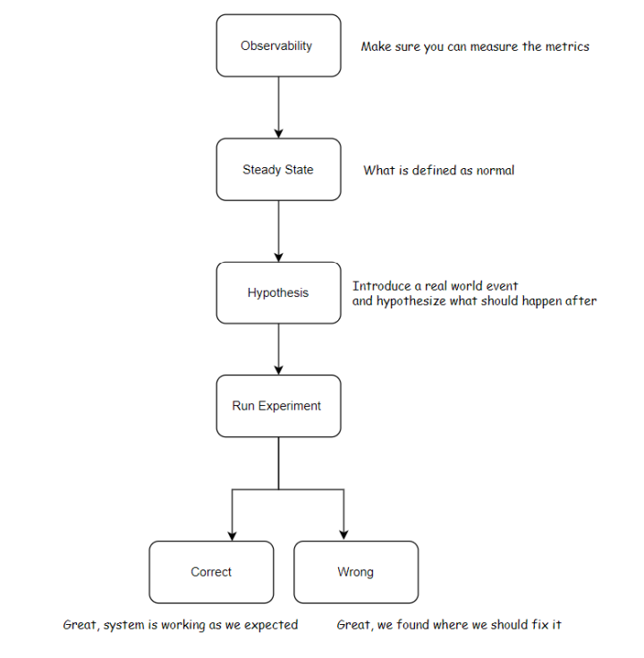
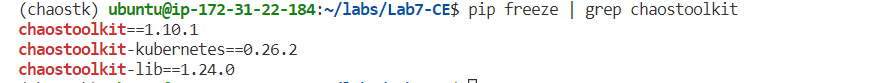
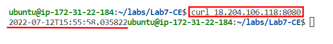
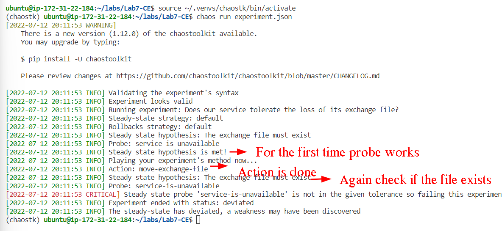
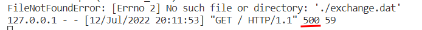

## INTRODUCTION
Chaos Engineering is the discipline of experimenting with a system in order to build confidence in the system’s capability to withstand turbulent conditions in production.

## MISCONCEPTIONS
* CE is not a silver bullet and doesn’t automatically fix your system.
* A common misconception is that chaos engineering is about randomly destroying stuff. Although randomness is powerful, still you want to control the variables you are interacting with as closely as possible.
* Adding failure is the easy part; the hard part is knowing where to inject it and why.
* Chaos engineering is not just those available tools. We have many tools like Chaos Monkey, [Chaos Toolkit](https://chaostoolkit.org/), [PowerfulSeal](https://github.com/bloomberg/powerfulseal), or any of those projects available on GitHub. Although the tools make it easier to implement certain types of experiments, the real difficulty is learning how to look critically at systems and predict where the fragile points might be.
* Chaos engineering doesn’t replace other testing methods, such as unit or integration tests. Instead, it complements them.
* Although some overlap exists, chaos engineering doesn’t stem from chaos theory in mathematics and physics.
* The CE is not just about Kubernetes, it’s about inside Kubernetes and outside of it

## METHODOLOGY
What we usually want to do is to build a **hypothesis** around the **steady-state behavior**. What that means is we want to define how our system, or a part of it, behaves under specific conditions or in a normal state(ideal case). We want to perform some potentially damaging actions on the network, on the applications, on the nodes, or against any other component of the system. Those actions are, most of the time, very destructive.
```
We want to validate a hypothesis by starting our system in a steady state, then
performing some destructive actions, and after that, we check the state of the system and validate if the state of the system has changed or not.
```

So this is the list of activities at a high level:
* Define the steady-state hypothesis.
* Produce or simulate “real world” events to introduce the chaos.
* Confirm the steady-state.
* Use metrics, dashboards, and alerts to confirm that the system as a whole is behaving correctly.

### EXPERIMENTS
Chaos engineering experiments (chaos experiments, for short) are the basic units of chaos engineering. You do chaos engineering through a series of chaos experiments. You create chaos experiments to discover the weaknesses of your infrastructure and ultimately improve them. Given a computer system and a certain number of characteristics you are interested in, you design experiments to see how the system fails when bad things happen. In each experiment, you focus on proving or rejecting your assumptions about how the system will be affected by a certain condition.
When your run your experiment, the following information should be reported:
* The syntax of your [experiment.json](./experiment.json) is checked.
* The experiment starts.
* The Steady-State Hypothesis is checked to ensure the system is currently in a
recognizable normal state (called the system is within tolerances), to begin the experiment.
* The experimental method is executed.
* If an unexpected weakness is found that is affecting the availability of the service, it will be shown.
* If there are no rollbacks declared, the experiment comes to a close.



## INSTALLATION
* Run the following command. First, we install Python virtual environment 
''' 
sudo apt-get install python3 python3-venv 
'''
* Then we create a virtual environment. We call it chaostk (for chaos toolkit)
python3 -m venv ~/.venvs/chaostk
* Then we activate that environment
source ~/.venvs/chaostk/bin/activate
* You will see the prompt changed.
* Then we install the chaostoolkit
pip install -U chaostoolkit
* If you get an error message about the “wheel” package you can install it by the following command:
pip3 install wheel
* Make sure it’s installed successfully
chaos --version
NOTE: to exit from the virtual environment run:”deactivate” command
* Now you can install the Kubernetes integration through its Chaos Toolkit extension using pip:
pip install -U chaostoolkit-kubernetes
* The pip tool fetches the chaostoolkit-kubernetes extension and installs it along with any necessary dependencies. You can now check that this extension is properly installed by executing:
pip freeze | grep chaostoolkit

NOTE: Since in this practise we are practising in Kubernetes, make sure that Kubernetes is up and running.

## CREATING THE FIRST CHAOS EXPERIMENT
To use the chaos command you need to be in the Python virtual environment that you have created earlier. If you have deactivated that, run the following:
source ~/.venvs/chaostk/bin/activate
### A Running Application
* First, run the service.py . This code creates a file called exchange.dat and writes the current date and time every 10 seconds. Read the [service.py](./service.py) code to get a better understanding.
[service.py working](./images/service.py%20working.png)
* In the terminal run the service like below:

* And in the second terminal,run the following command. The endpoint shows the content of exchange.dat:
curl <<publicIP>>:8080

We can ctrl+c now to stop the service. 

### Experiment File
Experiments in the Chaos Toolkit are described declaratively using an open and implementation agnostic JSON format. Experiments start with a title, a description, and some optional tags that can help when you have a catalog of experiments to work with. Our experiment here is simply to ensure that the service should not break if a file is removed, and it simply tries again until the file comes back. Make sure the file experiment.json exists in the local folder. 
####  “Steady State Hypothesis” block
A steady-state Hypothesis models the characteristics of a steady state of the system based on expected values of the business metrics. You should know what a normal state and its domain (toleration) look like in our system. In our example, our normal case is we want to get a valid response code (200 OK) every time we hit the service, that’s all
we tolerate (simple criteria) .
The Chaos Toolkit uses the Steady State Hypothesis for two purposes. It’s used as a check before an experiment runs to make sure the target system is in a recognized normal state.
The Steady-State Hypothesis is also used as the template for comparison of the state of our system after the experiment runs.
#### "Method" block
Every Chaos Toolkit experiment needs a method, which is the list of actions you'd like to perform on our system before running the experiment and to make sure the Steady State Hypothesis is within its tolerances.
In this methods for the experiment we're creating are listed below:
* Move the exchange.dat file to a new, unexpected filename while the service is running so the service will not be able to find the file in the designated place.
* Probe to see that the response of the running service has flipped to return 503 rather than the 200 OK that was originally produced.

### Running the Experiment
Your experiment here is simply to ensure that the service should not break if a file is removed, and it simply tries again until the file comes back. Now imagine the system that you want to test is represented as a single Python service in [service.py](./service.py), and your experiment is all set in the [experiment.json](./experiment.json) file, to explore a potential weakness in that system.
* Open a second terminal and make sure the service is still running by :
python3 service.py
*  In the first terminal, make sure you are in the virtual environment and now run the experiment:
chaos run experiment.json

* If you look into the other terminal, you see that it has generated a 500 code. That code was not in the domain of toleration:


## OBSERVATION
As you should see, the experimental output states that there was a detected weakness as there was a deviation from your Steady State Hypothesis after the experiment's method had completed.


